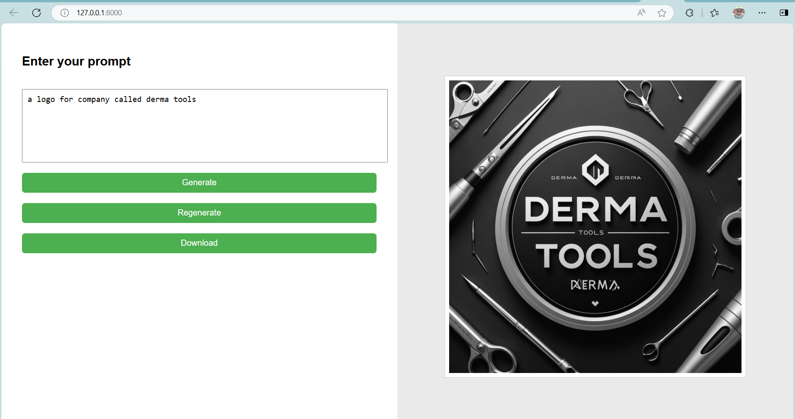
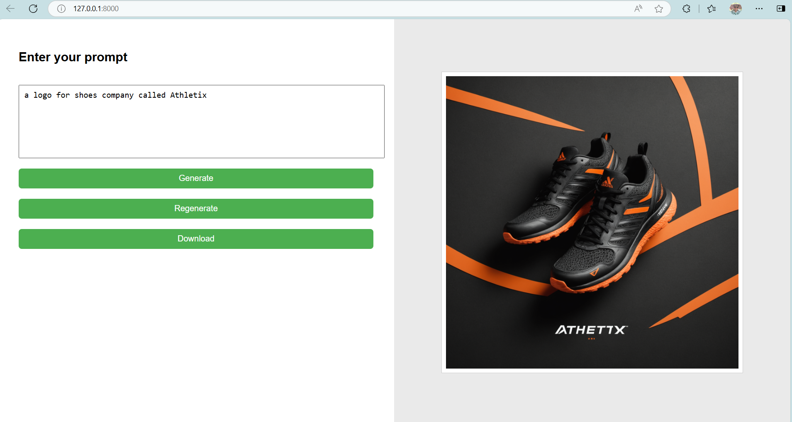

# 🧠 PromptCraft - AI-Powered Image Generator

PromptCraft is a Gen AI-backed web application that lets users generate highly-stylized images using natural language prompts. It leverages **LangGraph** to structure prompt processing as a graph and **Stability AI’s image generation API** to produce high-quality outputs — all wrapped in a clean **Django REST Framework** backend and a lightweight HTML/JS frontend.

---

## 🚀 Features

- 🧾 Prompt input UI (built in plain HTML/CSS/JS)
- 🧠 Graph-based prompt enhancement pipeline via **LangGraph**
- 🎨 AI image generation using **Stability AI API**
- 📁 Downloadable image output (no media file saved on the server)
- 🔁 Regenerate images from the same prompt
- 🧪 RESTful API built with Django REST Framework

---

## 🛠️ Tech Stack

| Layer        | Technology                | Purpose                                             |
|--------------|---------------------------|-----------------------------------------------------|
| Backend      | Django 5 + DRF            | API routing and web view rendering                  |
| Prompt Flow  | LangGraph                 | Graph structure for validating, templating, enhancing prompts |
| AI API       | Stability AI              | Actual image generation from final prompt           |
| Frontend     | HTML + CSS + JavaScript   | Simple UI for prompt input and result display       |

---

## 🧩 LangGraph Nodes

The prompt is processed through this LangGraph pipeline:

```
ValidateInput → TemplatePrompt → EnhancePrompt → GenerateImage → WrapResponse
```

Each step:
- **Validates** user input
- Applies a **base template** like `An image of {content}`
- Enhances with style modifiers: `ultra-detailed, studio lighting, trending on ArtStation`
- **Calls Stability AI API** to generate the image
- Wraps final output (`final_prompt` + `image` as a downloadable file)

---

## 🧪 API Endpoint

```http
POST /api/generate-image/
```

**Request:**
```json
{
  "prompt": "Lighthouse on a cliff overlooking the ocean"
}
```

**Response:**
```json
{
  "final_prompt": "An image of Lighthouse on a cliff..., ultra-detailed, ...",
  "image": "<base64 image blob or downloadable stream>"
}
```

---

## 🖥️ How to Run Locally

```bash
# 1. Clone this repo
git clone https://github.com/your-username/promptcraft.git
cd promptcraft

# 2. Create virtual environment
python -m venv venv
source venv/bin/activate  # or venv\Scripts\activate on Windows

# 3. Install dependencies
pip install -r requirements.txt

# 4. Add your Stability AI key
echo STABILITY_API_KEY=your_key_here > .env

# 5. Run server
python manage.py runserver
```

Open [http://127.0.0.1:8000/](http://127.0.0.1:8000/) to view the UI.

---

## ✨ Future Plans

- Add user authentication for saved prompt history
- Add style dropdowns or image type selector
- Deploy live on Render / Railway / Vercel

---

## 📢 License & Credits

- Built by Aryan Dhull
- Stability AI API: [https://platform.stability.ai](https://platform.stability.ai)
- LangGraph: [https://docs.langgraph.dev](https://docs.langgraph.dev)

---

## 📌 Screenshots




---

## 🙌 Contributions

Pull requests and suggestions are welcome! Just open an issue or drop a PR.
